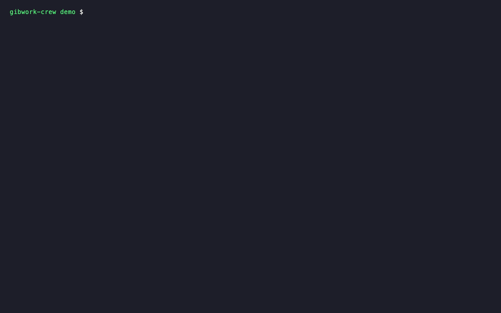

# gibwork-crew

Take a [Gibwork](https://gib.work) bounty, split it into subtasks, pay sub-agents **on verified delivery**, and submit the assembled work back to Gibwork. It runs as a terminal CLI and as an MCP server, with no web app.

Built for the Gibwork Developer Hackathon (non-web-app track). The entry was not submitted: Gibwork requires an active platform account for submissions, and the team chose not to create one.

**Gibwork toolset used:** the official **Gibwork SDK** (`@gibwork/sdk`). It handles discovery (`tasks.listAvailable`, `tasks.get`) and submission (`submissions.prepareCreate`, `submissions.create`, `submissions.getIntent`).

## Why

An agent that takes a bounty often needs help: a translation, a data extraction, a test run. Paying a sub-agent up front risks non-delivery, and paying afterwards puts all the risk on the sub-agent.

`gibwork-crew` funds one USDC escrow per subtask on Solana through [Select Escrow v2](https://api.tryaigility.com):
- **artifact-hash rule:** the sub-agent is paid automatically when its output's SHA-256 equals the hash fixed at funding time;
- **payer-approval rule:** the crew lead releases payment by signing an approval;
- **after the deadline:** the payer can take the money back without anyone's permission;
- **receipts:** every subtask leaves a public receipt (`rufus://<task>`).

Gibwork's own escrow still pays the bounty winner. Select only covers the sub-agents, so the two are complementary.

## Install

```bash
npm install -g github:SiiahK/gibwork-crew      # builds dist/ on install (Node >= 22)
# or, from a clone:
git clone https://github.com/SiiahK/gibwork-crew && cd gibwork-crew && npm install && npm test
```

## Environment

| Variable | Purpose |
|---|---|
| `CREW_WALLET` | Path to a Solana keypair JSON file. It pays the escrows and is your Gibwork wallet. Never paste keys into chat or into `crew.json` |
| `CREW_RPC_URL` | Solana mainnet RPC endpoint |
| `SELECT_API` | Select evidence intake (default `https://api.tryaigility.com`) |
| `GIBWORK_PRODUCTION=1` | Use Gibwork production (default: Gibwork stage) |
| `CREW_MAX_SUBTASK_USDC` | Per-subtask ceiling, at most 10 (the Select pilot limit) |
| `SELECT_AFFILIATE` | Optional integrator authority that receives 25% of the Select fee. It is never the payer |

## Commands

Every spending step is a **dry run unless `--yes`**.

```text
gibwork-crew scout   [--min 5] [--tag Docs] [--pages 2]       rank open USDC bounties; human-gated ones last
gibwork-crew plan    <taskId> --budget 3 \
                     --sub "write|Write the guide|<callee>|2|<sha256>" \
                     --sub "review|Review it|<callee>|1"      write crew.json (sha256 → artifact rule; none → approval)
gibwork-crew fund    crew.json [--yes]                        exact escrow costs; --yes funds them
gibwork-crew collect crew.json [--from ./outputs] [--approve review]
                                                              deliver verified outputs, approve, refresh
gibwork-crew status  crew.json                                state and receipt of every subtask
gibwork-crew submit  crew.json --content work.md [--quote | --yes]
                                                              dry by default; --quote asks Gibwork for the fee
gibwork-crew ledger  crew.json                                Gibwork bounty ↔ Select escrows ↔ receipts
```

### Sample output (real)

`fund` dry run against Solana mainnet for a 2-subtask crew. Nothing is signed. The settlement worker's policy is checked live:

```json
{
  "lines": [
    {
      "id": "write",
      "grossUsdc": "2",
      "feeUsdc": "0.04",
      "calleeReceivesUsdc": "1.96",
      "rentLockedSol": "0.005227",
      "rentReturnedSol": "0.002865",
      "blocking": [],
      "warnings": []
    },
    "…"
  ],
  "totalGrossUsdc": "3",
  "confirmed": false,
  "next": "dry run: nothing was signed. Re-run with --yes to fund these escrows."
}
```

### Mainnet run (2026-10-06)

The full lifecycle ran on Solana mainnet against the live hackathon bounty: scout → plan → fund → collect → settle → close → submit (dry run). Recorded outputs, the Solscan link for each transaction, and screenshots are in [`docs/demo/mainnet-2026-10-06`](docs/demo/mainnet-2026-10-06/README.md).
- Two sub-agent escrows were funded, delivered and settled automatically: 1.96 USDC on a matching SHA-256, and 0.98 USDC on the payer's approval.
- This was an internal demo: Select Team wallets only.

**Demo video (100 s):** [`docs/demo/video/demo.mp4`](docs/demo/video/demo.mp4). It is a real terminal session on the team's server, recorded with [VHS](https://github.com/charmbracelet/vhs) from [`demo.tape`](docs/demo/video/demo.tape).
- Commands shown: scout and plan on Gibwork production, a dry-run cost preview, then the status, ledger and on-chain USDC movements of the paid mainnet run, and the submission preview.
- Nothing is spent in the recording.



## MCP server

Setup for Claude Code and other MCP clients: [`docs/mcp-quickstart.md`](docs/mcp-quickstart.md). The crew file format is described in [`docs/crew-file.md`](docs/crew-file.md).

```bash
CREW_RPC_URL=<rpc> CREW_WALLET=<keypair.json> gibwork-crew-mcp
```

The server exposes five tools: `crew_scout`, `crew_plan`, `crew_fund_preview`, `crew_status` and `crew_ledger`.
- **No tool spends money.** Funding escrows and paying Gibwork's participation fee happen only through the CLI with `--yes`.
- The wallet is used only to sign Gibwork's wallet-authenticated discovery requests.

## Safety

- **Spend guards:** per-subtask ceiling (at most 10 USDC), crew budget, and no paying yourself. Retries reuse the same escrow address, so a retry never charges twice.
- **Delivery check:** a sub-agent's output is hashed locally first, and a mismatch is never posted.
- **Gibwork fee:** submitting to Gibwork charges a participation fee. `--quote` shows it, and only `--yes` pays it.
- **Crew file:** `crew.json` is written atomically after every funded subtask, so an interruption never loses an escrow address.

## Costs and limits

- **Select fee:** 2% of each subtask, taken at funding and not refunded. The sub-agent receives the rest.
- **Rent:** about 0.0052 SOL is locked per escrow, and about 0.0029 SOL comes back when the task closes.
- **Limits:** Select runs with a pilot limit of 10 USDC per task. **The Select program has not had an external audit yet**; its deployed binary is reproducible from source.
- **Gibwork SDK licence:** `@gibwork/sdk` 0.2.0 is published as `UNLICENSED`. This project only depends on it from npm and does not copy its code.

## Tests

`npm test` runs network-free tests:
- crew file and exact amounts;
- spend guards;
- bounty ranking;
- the dry, quote and confirm submission modes;
- artifact delivery (a wrong output is never posted);
- payer approval (signature checked against the exact release message).

The full lifecycle also runs end to end in Select's main repository, against a LiteSVM replay of the deployed program:
- fund two escrows;
- reject a wrong output and deliver the right one;
- approve the second subtask;
- have the production settlement decision pay both sub-agents;
- submit and write the ledger.

## License

MIT — Select Team.
