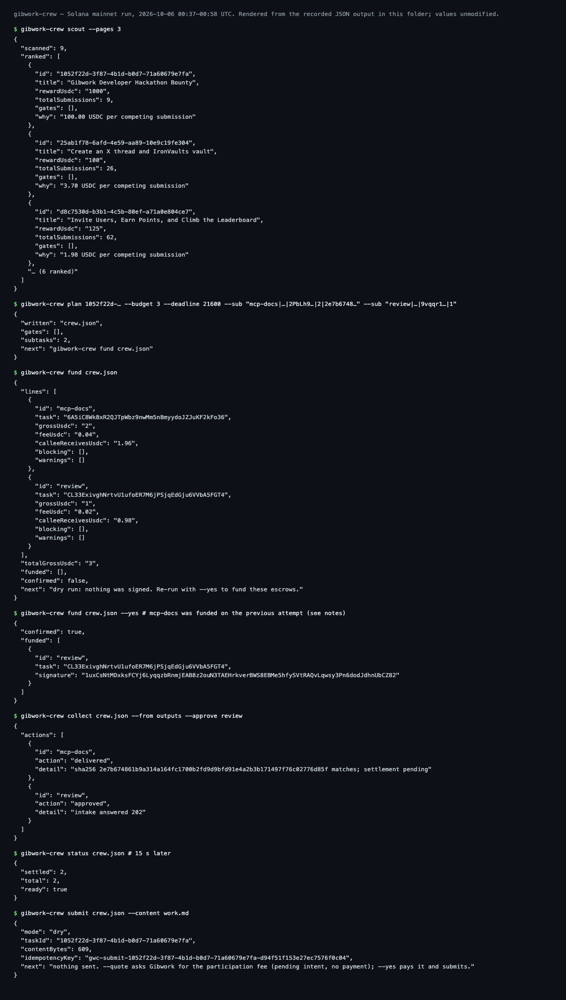

# Mainnet run — 2026-10-06 (00:37–00:58 UTC)

This is a real `gibwork-crew` run on Solana mainnet against the live Gibwork bounty "Gibwork Developer Hackathon Bounty" (`1052f22d-3f87-4b1d-b0d7-71a60679e7fa`).

- **Scope:** two subtasks, each paid through Select Escrow v2 on verified delivery.
- **What the sub-agents produced:** the subtask output is a real deliverable of this project, [`docs/mcp-quickstart.md`](../../mcp-quickstart.md). It was paid when its SHA-256 matched the commitment fixed at funding time. The second subtask, a review of that document, was released by the payer's approval.
- **Internal demo:** the payer and both sub-agents are Select Team wallets. No third party was paid.
- **Not done:** the Gibwork submission (participation fee) was **not** paid in this run. It ran as a dry run. The only bounty this work genuinely completes is the hackathon bounty itself, so the paid submission is the final entry, sent separately.

## Transactions

| Step | Subtask | Signature | Solscan |
|---|---|---|---|
| Fund (2 USDC; fee 0.04 to the treasury, 1.96 to escrow) | mcp-docs | `5jFQDvqh…Vx6yD9N` | [view](https://solscan.io/tx/5jFQDvqhnfaWahRkwSW1PzED5zrUQwv4UCHhABnkscUA9NZKcHv7Q6NmeLwmxmoUjVJJzGZ96GvH3Qn41Vx6yD9N) |
| Fund (1 USDC; fee 0.02 to the treasury, 0.98 to escrow) | review | `1uxCsNtM…UbCZ82` | [view](https://solscan.io/tx/1uxCsNtMDxksFCYj6LyqqzbRnmjEAB8z2ouN3TAEHrkverBWS8EBMe5hfySVtRAQvLqwsy3Pn6dodJdhnUbCZ82) |
| Settle: artifact hash matched → 1.96 USDC to `2PbLh9…` | mcp-docs | `PGMYxGsn…pGB7Se` | [view](https://solscan.io/tx/PGMYxGsnY9i8ZVTPzuGK4KB7fR2qk3X7DjgG9AWdad545VRVLUewA1AJe8wKRLAW1z9WGhJZxVnjL3tU1pGB7Se) |
| Settle: payer approval → 0.98 USDC to `9vqqr1…` | review | `J1km1DDN…75BetE4` | [view](https://solscan.io/tx/J1km1DDNgecb6ibJoB3DqGNWti7TJy9pMmLXKXnSGLqHApuKxHJAqHLa7V8aFRNuPC2fTTyPWcJm5d6875BetE4) |
| Close (rent back to the payer; 105-byte tombstone kept) | review | `KHGNT3RN…uAZkR1` | [view](https://solscan.io/tx/KHGNT3RN3T23nXD8SYv8KQMwMkcLQ7cffMaGH74i95pJnbMzbZZ67iaL4965xgi4aeRDvX1LSVTJEnyi9uAZkR1) |
| Close | mcp-docs | `67bGAXWg…8nxohbr` | [view](https://solscan.io/tx/67bGAXWgECmkKwrhi5FkEMXAWMAB2H8AAowVuUeq5KzrTzTEbUSQxtHVhvhWHfZafhE6rQJDGm86W19f8nxohbr) |

Escrow task accounts:
- `6A5iC8WkBxR2QJTpWbz9nwMm5nBmyydoJZJuKF2kFo36` (mcp-docs; receipt `rufus://6A5iC8WkBxR2QJTpWbz9nwMm5nBmyydoJZJuKF2kFo36`);
- `CL33ExivghNrtvU1ufoER7M6jPSjqEdGju6VVbA5FGT4` (review).

Public receipts: `https://api.tryaigility.com/v2/receipts/<task>`.

The USDC movements of all four value-moving transactions, read back from the chain, are in [`07-deltas.json`](07-deltas.json). The treasury (owner `HBZPPQ…`) received exactly 0.06 USDC, and the sub-agents received 1.96 and 0.98 USDC.

Screenshots of each transaction on the Solana Explorer are in [`screenshots/`](screenshots/), numbered 1–6. Solscan blocks automated browsers, so the captures come from the official explorer; the Solscan links above show the same transactions.

## Timeline

| UTC | Event |
|---|---|
| 00:37 | `scout` (Gibwork production, wallet-authenticated): 9 bounties scanned, 6 ranked |
| 00:42:39 | `plan` on the hackathon bounty; `fund` dry run: fees 0.04 and 0.02, no blocking, no warnings |
| 00:43:29 | `mcp-docs` escrow funded |
| 00:44:20 | `review` escrow funded |
| 00:44:45 | `collect`: artifact delivered (hash matches); review approved (intake 202) |
| 00:44:51 | Production settlement worker settles both, about 6 s after the evidence |
| 00:47:53 | `submit` dry run: no Gibwork call, nothing paid |
| 00:57:34–00:57:50 | Worker closes both after its 10-minute grace period |

## What went wrong, and the fix

The first `fund --yes` attempts failed with `failed to get block time for slot …: Block not available`.

- **Cause:** the cluster clock was read with `getBlockTime(latest slot)`, and the RPC had not yet stored that block.
- **What happened during the failed attempts:**
  - `fund` previews every subtask first, then funds them one by one. One attempt funded `mcp-docs`, then failed on the expiry check of the `review` preview, before funding it.
  - The crew file had already been saved after the first escrow, so the next run funded only `review`.
  - Nothing was charged twice.
- **Fix:** `gibwork-crew` now reads cluster time from the Clock sysvar, the same clock the program uses for deadlines (commit `defc2f1`). The run then completed.

## Files

| File | Content |
|---|---|
| `01-scout.json` | `scout` output |
| `02-plan.json` | `plan` output |
| `crew.json` | Final crew file: escrows, receipts |
| `03-fund-dry.json` | Dry-run cost preview |
| `04-fund.json` | Successful `fund --yes` (the `review` escrow) |
| `05-collect.json` | Delivery and approval |
| `06-status.json` | Both subtasks `Completed` |
| `07-deltas.json` | Token balance changes, read from the chain |
| `08-submit-dry.json` | Gibwork submission, dry run |
| `09-status-final.json` | After close |
| `10-ledger.json` | Bounty ↔ escrows ↔ receipts |
| `close-sigs.txt` | Close transaction signatures |
| `work.md` | Draft submission text |
| `terminal.html` | Source of `screenshots/0-terminal-run.png` |
